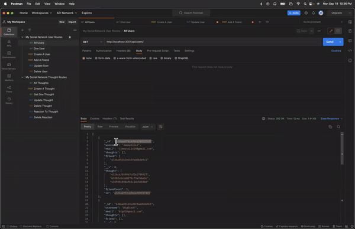
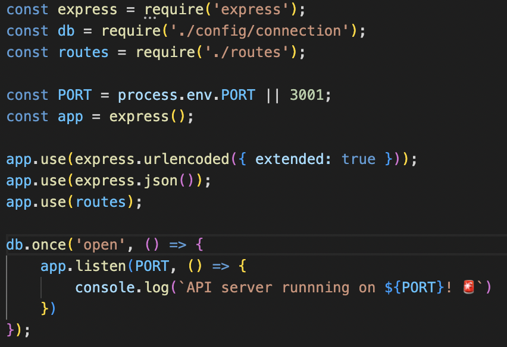
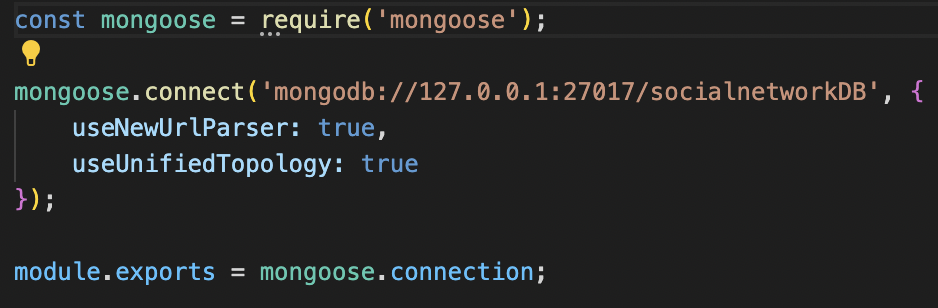
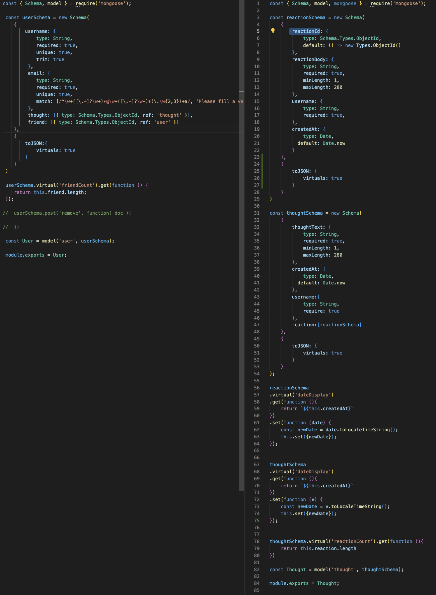
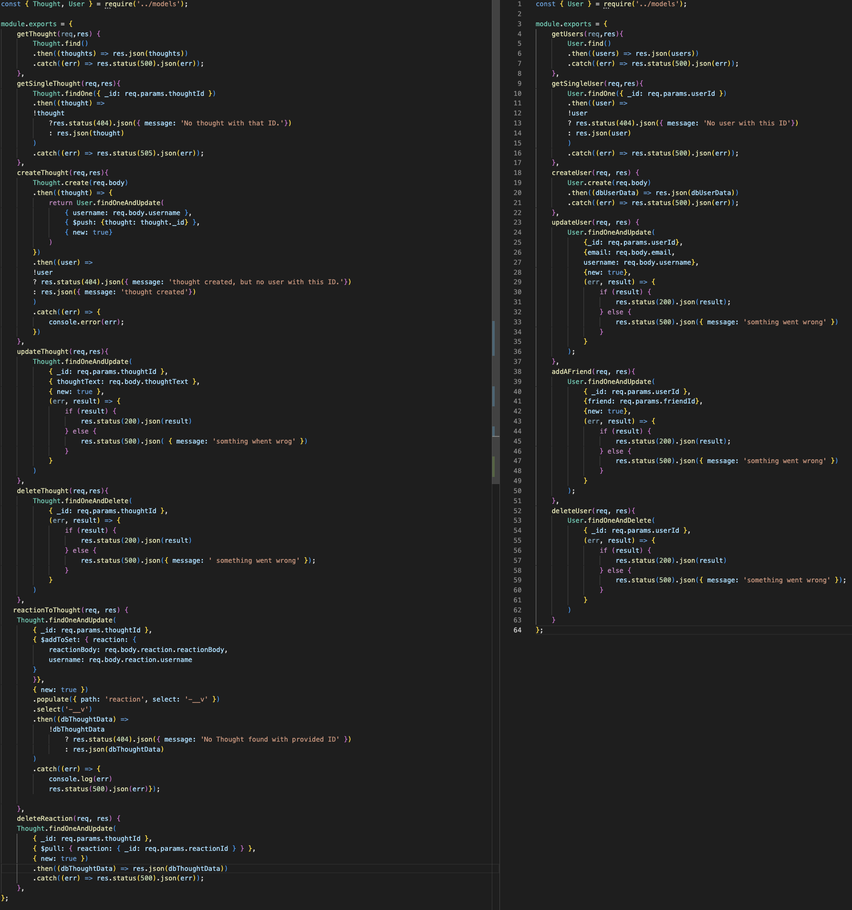
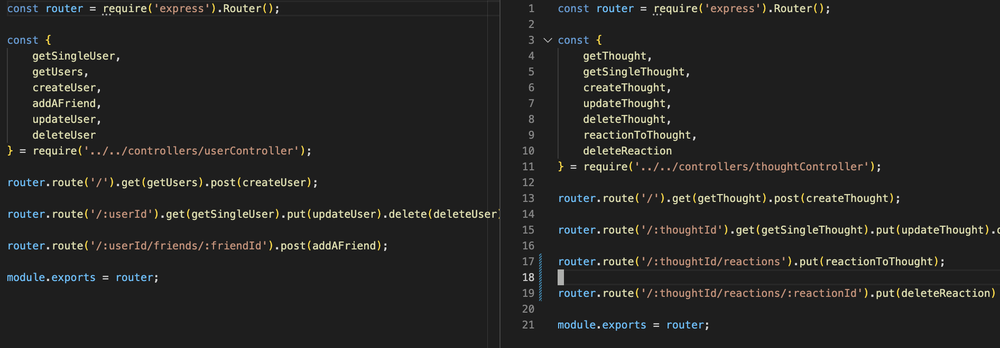

# My Social Network 
   

  ## Description
  In this project I had the task of creating the back-end of a socail application. The API was made possible through MongoDB and Mongoose. 

  ## Table of Contents 
  - [Installation](#installation)
  - [Usage](#usage)

  ## Installation
  Download the files through my gitHub.

  ## Usage
  Please watch the walk through video I made for this app. In it I demonstrate all the routes.

  ## Questions
  Here is my email for questions:  jimmysolis14@gmail.com
   
  If you would like to look me up in github, here is my username: [JimmySolis](https://github.com/JimmySolis)
   
  Follow these instructions to contact me:  
  Please Email me. I will get back in a business day.

  ## How it Works

  ### Click ⬆ image above to see walkthrough video ⬆

  ## Code Break Down:

  ## 1) The most important file the server. This file begins the app and on top of that here I declare all the packages and dependencies I want my app to use.
  
  

  ## 2) Next, we move on to make a connection. I need to make sure I connect to MongoDB.
  

  ## 3) In this file I make the models. Sticking with mongoose to make my schemas.
  

  ## 4) Once everything is in place I beging to buld the functions that will relay the needed steps to create, update, post or delete data.
  

  ## 5) Finally, I attach all the functions to routes and the fun begins! 
  
  